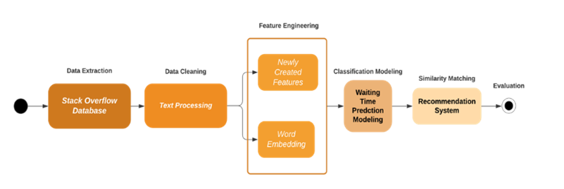

# BT5153-Recommendation-System-for-Stack-Overflow
 

  

<h3 align="center">Shoot the Long Waiting Pain — Recommendation System for Stack Overflow</h3>

    

        Group15 Project for NUS BT5153 FY2021
    

    

        Chen Yiqiu, Gao Jin, Li Xinlin, Qu Mingyu, Tan Sijie
    

# About the Project

***In the project, we wish to predict the waiting time to receive a solid answer by identifying potential features.*** 

We have extracted a raw dataset from the Stack Exchange Data Explorer, a tool for executing arbitrary SQL queries against data from [Stack Overflow Database](https://meta.stackexchange.com/questions/2677/database-schema-documentation-for-the-public-data-dump-and-sede), using the custom [query](https://data.stackexchange.com/stackoverflow/query/edit/1373717). This raw dataset consists of total 190234 questions which are relevant to Python and Data Science (post tags contain ‘python’, ‘numpy’ and ‘scikit-learn’ etc.) with the accepted answers in the past 2 years covered from Jan 2019 to Jan 2021. 

***By digging into the post content, we also wish to launch a recommendation system that provides the most relevant and popular posts to one certain question posted to improve user experience by shortening their waiting time.*** 

  

# Getting Started

## Dataset

- `data/dataset.csv`

  We explored the Entity-Relationship Diagram (ERD) and identified three key tables which are relevant for our analytic purpose. 

  - *Question* table consists of information of question posts like titles with the corresponding accepted answer ID which is the key to link to *Answer* table.  

  - *User* table consists of the information of the question owner like *reputation* etc.

  - *Answer* table consists of the details of the answer for the questions which ID is *ParentId*.

## Code

- `src/waiting_time_prediction.ipynb`

  Primary notebook of waiting time prediction, including *data loading*, *data processing*, *model implementation* and *machine learning interpretation*.

- `src/waiting_time_prediction_auxiliary.ipynb`

  Auxiliary notebook of waiting time prediction which consists of *baseline model* without any data precessing.

- `src/recommendation_system.ipynb`

  Notebook of *recommendation system* powered by vector space matching technology

# Road-map

In this paper, we attempt to implement several multiple traditional classification models and Neural Networks to predict the waiting time of getting an accepted answer. Followed by further exploring the content of questions, we attempt to propose the recommendation model to capture the semantic similarity which can help us to find the most relevant historical posts to one certain question posted by users. 

## Data Processing

### Data Pre-processing

Prior to the model implementation, text cleaning needs to be conducted and is divided into the following steps: 

(1) remove all HTML tags (e.g., `

`); (2) remove punctuations; (3) change remaining words into lowercases; (4) remove stop words (Python NLTK package); (5) join words back to sentences. As the result, we cleaned original texts into 3 new columns “clean_title”, “clean_question” and “clean_answer”. 

### Feature Extraction

Feature engineering involves leveraging data mining techniques to extract new features from raw data along with the use of domain knowledge (on-line Q&A forum here). It is useful to improve the performance of machine learning algorithms and is often considered applied machine learning.

### Word Embedding

In this section, we transform the user input questions (‘clean_question’) to numerical vectors by 3 methods. The words will be represented as an N-dimensional vector.

-  **TF-IDF:** TF-IDF stands for Term Frequency – Inverse Document Frequency. It is one of the most important techniques used for information retrieval to represent how important a specific word or phrase is to a given document. The TF-IDF value increases in proportion to the number of times a word appears in the document but is often offset by the frequency of the word in the corpus, which helps to adjust concerning the fact that some words appear more frequently in general.
-  **Bag-of-words (BOW): **BOW can be done by assigning each word a unique number. Then any document we see can be encoded as a fixed-length vector with the length of the vocabulary of known words. The value in each position in the vector could be filled with a count or frequency of each word in the encoded document.
- **Word2Vec:** Word2Vec is one of the most popular representations of document vocabulary using a shallow neural network. It is capable of capturing the context of a word in a document, semantic and syntactic similarity, relation with other words

## Waiting Time Prediction

Waiting time is an important factor affecting user experience on the website. In this section, the main objective is to apply classification models to predict whether the users could get the satisfied answers within 30 mins based on their question input with other features.

### Model Development

As mentioned, since the object is to predict if the waiting time is beyond 30 mins, it is a binary classification. Various classic machine learning models were applied in this case. Following classifiers were trained and tuned with their respective parameters in this project

- **Naive Bayes:** Naive Bayes model is easy to build and useful for large datasets. Along with simplicity, Naive Bayes is known to outperform even highly sophisticated classification methods. Hence it is mostly used in text classification.
- **Logistic Regression:** Logistic regression is a classic machine learning algorithm that utilizes a sigmoid function and works best on binary classification problems, in this project we use this model to build up as a baseline model.
- **XGBoost:** XGBoost is an optimized Gradient Boosting algorithm through parallel processing, tree-pruning, handling missing values and regularization to avoid overfitting/bias. It’s suitable for categorical-intensive data with ideal generalization ability.
- **LightGBM:** LightGBM uses histogram-based algorithms, which bucket continuous feature (attribute) values into discrete bins. This speeds up training and reduces memory usage. It is capable of performing equally well with large datasets with a significant reduction in training time as compared to XGBoost.
- **Neural Network:** In the past few years, deep learning models have significantly expanded the capability of the natural language processing, and nearly all the model is based on the representation learning method. Neural networks are suitable models with nonlinear data with a large number of inputs, which makes them a compatible solution for natural language processing. It also could capture the massive interactions between heterogeneous types of features.

### Machine Learning Interpretability

- **Feature Importance:** Feature importance generated by the model (Figure 5)indicated the count-based importance (numbers of splits are counted), in which *Quenstion_Char_Length* ranks first and then followed by *Tag_Score* and *UserReputation*.
- **Partial Dependence Plot:** We use partial dependence plots (PDP) to show the marginal effect of the important features have on the predicted outcome of LightGBM. The marginal effect of “number of tags in class1” on the probability of getting satisfied answers exceeding 30mins shows a generally increasing trend as the number of class1 tags increases. That is, if the question has more tags in class 1, it is more likely to get a satisfactory answer for more than 30min. Other PDP are listed in Appendix.
- **LIME:** In addition to global importance, we use LIME to interpret the local importance of the features and show how they influence the expected answer time.

## Recommendation System Building

If the previous prediction model shows that a user will wait a quite long time which is beyond 30 mins for the accepted answer, we could take proactive actions to recommend historical similar questions with the answers to users for reference.  

The core idea in task here is to detect semantic similarity in questions posted in the forum. If a similar question is posted by a user, the system can identify the related question and then promote these solved questions with an accepted answer to the user.  

### Filter based on SimTitle and SimTag

- **Calculation of similarity score between title:** In this step, we fit a TF-IDF vectorizer using cleaned title data from history questions. After we have the fitted vectorizer, we transform the title of history questions and the input title into a dense matrix. Finally, we calculate the cosine similarity between the input title and each title from the raw dataset to get a similarity score for the title as SimTitle. 
- **Calculation of similarity score between tag:** Similarly, we have a TF-IDF vectorizer fitted on the tags for each question in the raw dataset. Then we apply the transform function on the input and all the tags in the raw dataset. After we get the dense TF-IDF matrix, we then get the cosine similarity score between each row of tags in the dataset and the input as SimTag. 
- **Filter by combinations of title and tags:** Based on the similarity score of both title and tags, we then calculate a similarity score.

### Recommendation based on Question Body Similarity Score

After we get filtered data, we then proceed to the final step of the recommendation system. 

Like the first 2 steps, we have a TF-IDF vectorizer fitted on the cleaned Question Body of history questions in the raw data set and transform the cleaned input question body and clean question body in the dataset into a dense matrix. Then we calculate the cosine similarity scores between the input question body and each clean question body of the history question. Finally, we rank the history questions by cosine similarity and output top 5 questions with the highest cosine similarity with the input question.

## Business Insights
- Encourage users to answer questions related to long-waiting tags related to deep learning.
- Long question body and the existence of code chunks would imply higher waiting time even though questions have popular tags like pandas.
- The average frequency of tags matters rather than the number of tags.
- Questions that post by users with high reputations should be focused on.
- A Three-filtering-step recommendation system is recommended.

## Limitation & Future Improvement

- Further feature engineering related to tag subscribers required
- Provide a better evaluation metric for the recommendation system
- Try multiple distance measures in the calculation of similarity for the recommendation system

## Conclusion

In this study, we explored potential features that may affect the waiting time of accepted answers for one post and built the waiting time prediction model. We showed that the waiting time prediction can be handled as a binary classification task. Based on actual data extracted from the Stack Overflow database, we found tag-related and text-related features play important roles in predictive power in the optimal model LightGBM with word vectorization. We also conducted machine learning interpretability analysis to have a deep dive into how features affect prediction outcomes in both the global and local settings. 

Based on the outcome of prediction models, we then proposed the recommendation model, which basic idea is built on cosine similarity of input text, to recommend similar posts to those questions that are predicted to have longer than 30mins waiting time. **In the whole project we built an integrated pipeline from data extraction to time prediction, then to post recommendations, which is of real business value for managing user posting experience on Q&A platform like Stack Overflow.**

